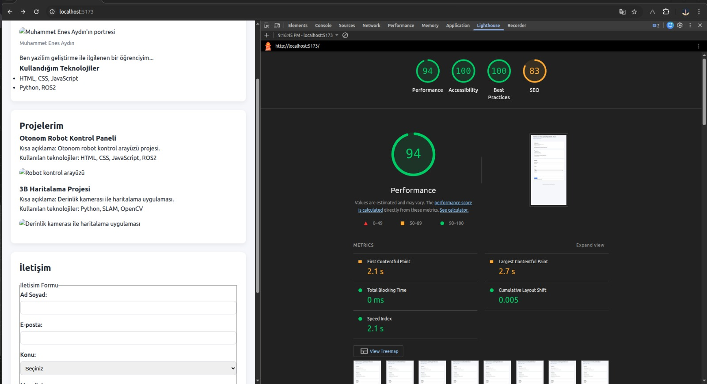
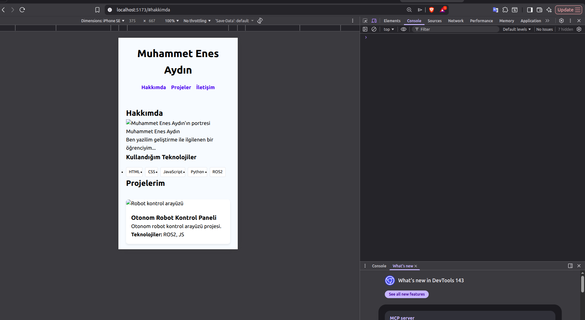
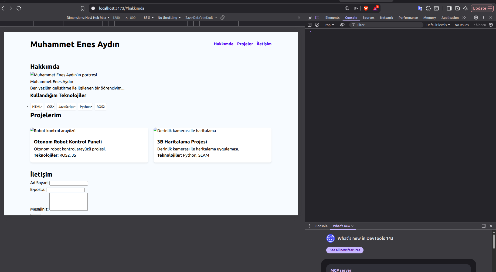
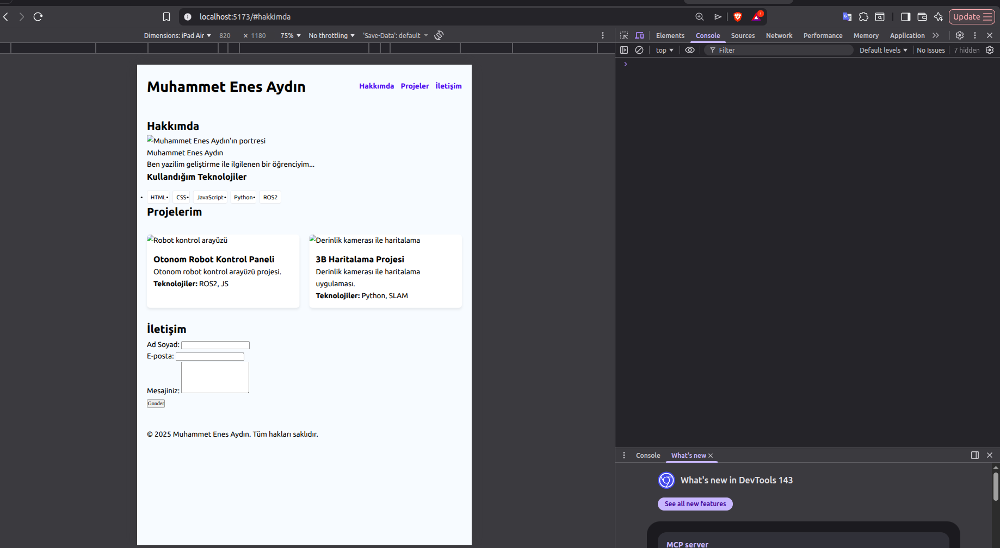

# Web LAB-3 - Modern Responsive Portföy Tasarımı

## Hakkında
Bu proje, Web Tasarımı ve Programlama dersi LAB-3 kapsamında; LAB-2'de oluşturulan içeriğin modern CSS teknikleri (Flexbox, Grid, Design Tokens) kullanılarak tüm cihazlara (Mobil, Tablet, Masaüstü) tam uyumlu hale getirilmiş versiyonudur.

# Geliştirici
Ad Soyad: Muhammet Enes Aydın

Öğrenci No: [Öğrenci Numaranızı Buraya Yazın]

# Uygulanan Modern CSS Teknikleri
Bu laboratuvar çalışmasında aşağıdaki teknikler uygulanmıştır:

Design Tokens: Tüm renk, boşluk ve tipografi değerleri tokens.css içerisinde değişken olarak tanımlandı.

Fluid Typography: Yazı boyutları clamp() fonksiyonu kullanılarak ekran genişliğine göre akıcı hale getirildi.

CSS Grid: Proje kartları repeat(auto-fit, minmax(280px, 1fr)) yapısıyla, media query gerektirmeden responsive hale getirildi.

Flexbox: Navigasyon menüsü ve yetenek etiketleri (flex-wrap) tek boyutlu düzenleme araçlarıyla hizalandı.

Mobile-First Yaklaşımı: Tasarım önce mobil cihazlar için optimize edildi, ardından 640px ve 1024px breakpoint'leri ile genişletildi.


# Proje Yapısı
Plaintext

```plaintext
/
├── index.html          # Semantik HTML yapısı
├── src/
│   ├── main.css        # Ana layout ve responsive kurallar
│   └── styles/
│       └── tokens.css  # Tasarım değişkenleri ve fluid typography
└── images/             # Proje görselleri ve profil fotoğrafı
```
## Kurulum ve Çalıştırma
Projeyi yerel makinenizde görüntülemek için dosyaları bir sunucu (örneğin VS Code Live Server) üzerinden açmanız yeterlidir.

## Kullanilan Teknolojiler
- React 18
- TypeScript
- Vite

## Kurulum
```bash
npm install
```

## Calistirma
```bash
npm run dev
```
Tarayicida http://localhost:5173 adresini ac.

## Ekran Goruntusu
---




---


